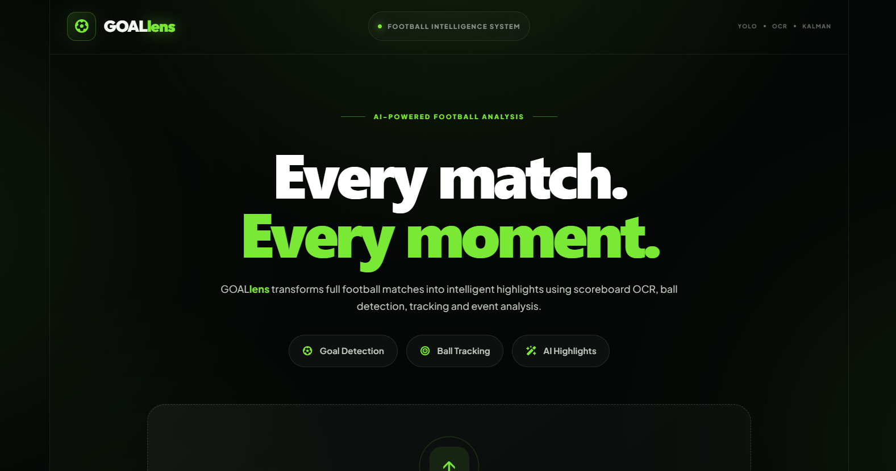
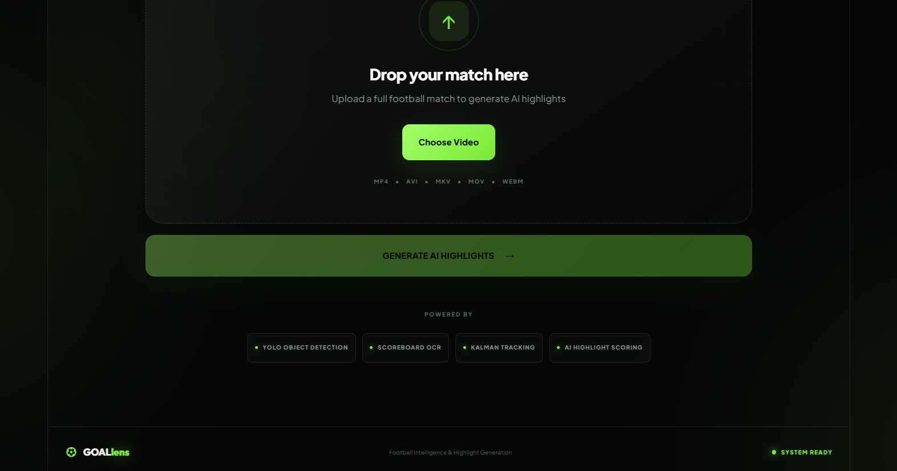
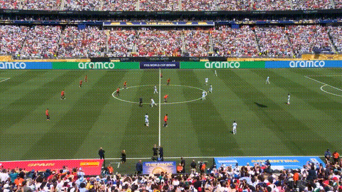

# ⚽ GOALLENS-AI

## AI-Based Football Highlight Detection and Generation

GOALLENS-AI is an AI-powered computer vision system that automatically analyzes football match videos, detects important events, and generates a concise highlight video.

The system combines **YOLO object detection, football tracking, scoreboard detection, OCR, temporal event analysis, and automated video processing** to identify important moments such as goals and ball-related events.

---

---

## 🖥️ Application Preview

### GOALLENS-AI Dashboard



### Highlight Generation Interface



---

---

## 🎬 Highlight Generation Demo

GOALLENS-AI automatically detects football events and generates highlight clips from the input match video.



The generated highlight pipeline combines ball-based event detection with scoreboard-based goal detection and merges overlapping highlight intervals into a final video.

---


## 📌 Problem Statement

Football matches can last more than 90 minutes and contain a large amount of gameplay that may not be relevant to viewers looking for important moments.

Manually reviewing an entire match to identify goals and other important events is time-consuming.

GOALLENS-AI aims to automatically analyze football match videos and generate highlight videos containing important moments without requiring the user to manually search through the entire match.

---

## 🎯 Objectives

The main objectives of GOALLENS-AI are:

* Detect the football in match videos.
* Track the football across consecutive frames.
* Handle temporary ball detection failures using interpolation and Kalman filtering.
* Detect the scoreboard using a custom YOLO model.
* Extract scoreboard information using OCR.
* Detect goal events from scoreboard changes.
* Generate highlight clips around detected events.
* Generate ball-based highlight clips.
* Merge overlapping highlight intervals.
* Produce a final AI-generated football highlight video.
* Provide a web-based interface for uploading and processing football videos.

---

## 🗂️ Dataset

### 1. SoccerNet Dataset

The project uses football video and tracking data from the **SoccerNet** dataset for computer vision development and evaluation.

SoccerNet is a large-scale football video understanding dataset containing professional football match data and annotations for various computer vision tasks.

Official dataset source:

https://www.soccer-net.org/

The dataset was used as the source for preparing football frames and annotations for the custom object detection pipeline.

### 2. Custom Football Object Detection Dataset

A custom football object detection dataset was prepared using football frames derived from the SoccerNet data.

The dataset contains the following classes:

| Class ID | Class |
|----------|-------|
| 0 | Player |
| 1 | Goalkeeper |
| 2 | Referee |
| 3 | Ball |

The trained YOLO object detection model is included in the repository:

```text
backend/models/ball_tracking/best.pt

3. Custom Scoreboard Dataset

A custom scoreboard dataset was prepared for training the YOLO-based scoreboard detection model used in the goal detection pipeline.

The trained scoreboard detection model is included in:

backend/models/scoreboard/best.pt
4. Match Videos

Football match videos were used for testing and demonstrating the complete GOALLENS-AI highlight-generation pipeline.

Due to the large size of football video files, the original match videos and generated highlight videos are not included directly in this repository.

Users can provide their own football match video as input when running the application.

Dataset Access Note: SoccerNet may require registration and acceptance of its dataset terms before downloading the dataset. The dataset itself is not redistributed in this repository.

## 🧠 Methodology

The GOALLENS-AI pipeline consists of several stages.

```text
Football Match Video
        │
        ▼
┌─────────────────────┐
│ Video Upload        │
└─────────┬───────────┘
          │
          ▼
┌─────────────────────┐
│ Ball Detection      │
│ YOLO                │
└─────────┬───────────┘
          │
          ▼
┌─────────────────────┐
│ Ball Tracking       │
│ Interpolation       │
│ Kalman Filtering    │
└─────────┬───────────┘
          │
          ▼
┌─────────────────────┐
│ Ball Event Analysis │
└─────────┬───────────┘
          │
          ├─────────────────────┐
          │                     │
          ▼                     ▼
┌─────────────────────┐  ┌─────────────────────┐
│ Scoreboard          │  │ Ball-Based          │
│ Detection           │  │ Highlights          │
│ YOLO + OCR          │  │                     │
└─────────┬───────────┘  └─────────┬───────────┘
          │                        │
          ▼                        │
┌─────────────────────┐             │
│ Goal Detection      │             │
│ Score Changes       │             │
└─────────┬───────────┘             │
          │                         │
          └────────────┬────────────┘
                       ▼
             ┌─────────────────────┐
             │ Highlight Merger    │
             │ Overlap Handling    │
             └─────────┬───────────┘
                       │
                       ▼
             ┌─────────────────────┐
             │ Final Highlight     │
             │ Video               │
             └─────────────────────┘
```

### Ball Detection

YOLO is used to detect the football in individual video frames.

### Ball Tracking

Detected ball positions are tracked over time. Temporary detection failures are handled using interpolation and Kalman filtering.

### Scoreboard Detection

A custom YOLO model detects the scoreboard region in the video.

### OCR

OCR is applied to the detected scoreboard region to extract score information.

### Goal Detection

Changes in the scoreboard score are analyzed to identify potential goal events.

### Highlight Generation

For detected events, suitable temporal windows are extracted from the original match video.

Goal events receive dedicated highlight windows, while ball-related events are processed using the ball highlight scoring pipeline.

### Highlight Merging

Overlapping highlight intervals are merged to avoid duplicate or unnecessarily repeated footage.

The final merged clips are concatenated to generate the AI-generated highlight video.

---

## 🛠️ Technologies and Libraries

### Backend

* Python
* FastAPI
* Uvicorn
* OpenCV
* NumPy
* Pandas
* PyTorch
* TorchVision
* Ultralytics YOLO
* EasyOCR
* SciPy
* scikit-image
* Pillow
* FFmpeg/video processing tools

### Frontend

* React
* Vite
* JavaScript
* CSS

### Machine Learning / Computer Vision

* YOLO
* Object Detection
* Ball Tracking
* Kalman Filtering
* Interpolation
* Optical/video-based temporal analysis
* OCR
* Scoreboard analysis

---

## 📁 Project Structure

```text
GOALLENS-AI/
│
├── backend/
│   ├── models/
│   │   ├── ball_tracking/
│   │   │   └── best.pt
│   │   │
│   │   └── scoreboard/
│   │       └── best.pt
│   │
│   ├── pipelines/
│   │   ├── ball_detector.py
│   │   ├── ball_highlight_generator.py
│   │   ├── ball_highlight_scorer.py
│   │   ├── ball_tracker.py
│   │   ├── highlight_merger.py
│   │   └── scoreboard_goal_detector.py
│   │
│   ├── utils/
│   ├── main.py
│   └── video_processor.py
│
├── frontend/
│   ├── public/
│   ├── src/
│   │   ├── assets/
│   │   ├── App.jsx
│   │   ├── App.css
│   │   ├── index.css
│   │   └── main.jsx
│   ├── package.json
│   └── vite.config.js
│
├── inspect_notebook.py
├── requirements.txt
├── .gitignore
└── README.md
```

---

## ⚙️ Installation

### Prerequisites

Make sure the following are installed:

* Python 3.10+
* Node.js
* Git
* FFmpeg
* NVIDIA GPU with CUDA support is recommended for faster YOLO inference.

---

## 1. Clone the Repository

```bash
git clone https://github.com/Abhinash08/GOALLENS-AI.git
cd GOALLENS-AI
```

---

## 2. Create the Python Environment

```bash
python -m venv .venv
```

### Windows

```powershell
.venv\Scripts\activate
```

---

## 3. Install Backend Dependencies

```bash
pip install -r requirements.txt
```

---

## 4. Start the Backend

From the project root:

```bash
cd backend
uvicorn main:app --reload
```

The FastAPI backend will be available at:

```text
http://127.0.0.1:8000
```

---

## 5. Install Frontend Dependencies

Open another terminal and run:

```bash
cd frontend
npm install
```

---

## 6. Start the Frontend

```bash
npm run dev
```

Vite will provide a local development URL, normally:

```text
http://localhost:5173
```

Open the URL in a browser to access the GOALLENS-AI application.

---

## 🤖 Model Files

Two trained YOLO models are included in the repository:

### Ball/Object Detection Model

```text
backend/models/ball_tracking/best.pt
```

### Scoreboard Detection Model

```text
backend/models/scoreboard/best.pt
```

If future model files exceed GitHub's file-size limitations, they should be hosted using an appropriate large-file or external storage service and linked from this README.

---

## 📊 Results

GOALLENS-AI successfully demonstrates an end-to-end football highlight generation pipeline.

The system is capable of:

| Component                  | Result      |
| -------------------------- | ----------- |
| Football Detection         | Implemented |
| Football Tracking          | Implemented |
| Detection Gap Handling     | Implemented |
| Interpolation              | Implemented |
| Kalman Filtering           | Implemented |
| Scoreboard Detection       | Implemented |
| Scoreboard OCR             | Implemented |
| Goal Detection             | Implemented |
| Ball Highlight Generation  | Implemented |
| Goal Highlight Generation  | Implemented |
| Highlight Overlap Merging  | Implemented |
| Final Highlight Generation | Implemented |
| Web Interface              | Implemented |

The final system successfully detects goal events through scoreboard analysis and displays the detected events in the web interface.

---

## 🎥 Sample Outputs

Sample input videos and generated highlight videos can be provided separately because football videos and generated clips can be large.

Recommended demonstration files include:

```text
Sample Input
    └── football_match_sample.mp4

Sample Output
    └── final_AI_highlights.mp4
```

Large media files should be hosted externally rather than committed directly to the Git repository.

---

## 📌 Important Notes

The following directories are excluded from Git using `.gitignore`:

```text
backend/uploads/
backend/outputs/
```

These directories contain uploaded videos, generated clips, temporary processing files, and runtime outputs.

The project models and source code are included in the repository.

---

## 🔬 Project Highlights

GOALLENS-AI integrates multiple computer vision techniques into a single football video analysis system:

* YOLO-based object detection
* Football tracking
* Temporal tracking recovery
* Kalman filtering
* Scoreboard detection
* OCR-based score extraction
* Goal event detection
* Ball-based event scoring
* Temporal highlight generation
* Overlap-aware highlight merging
* Automated video generation
* React-based visualization interface

---


